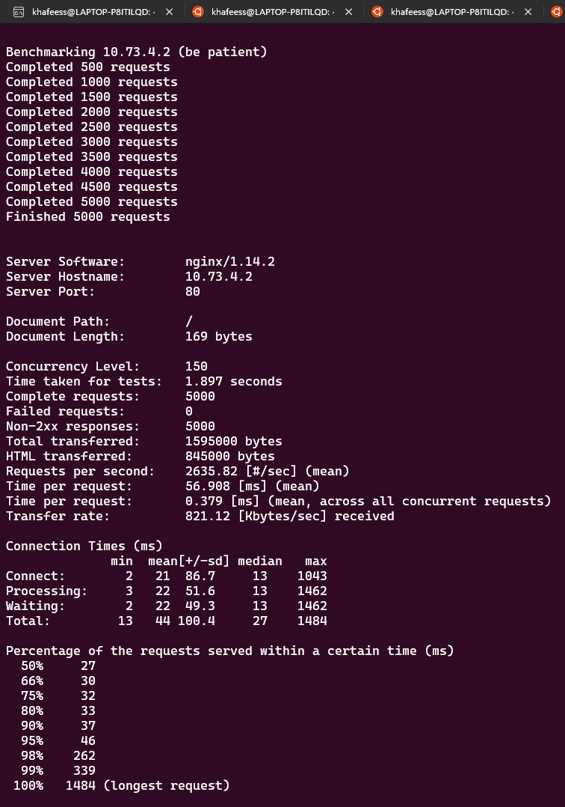
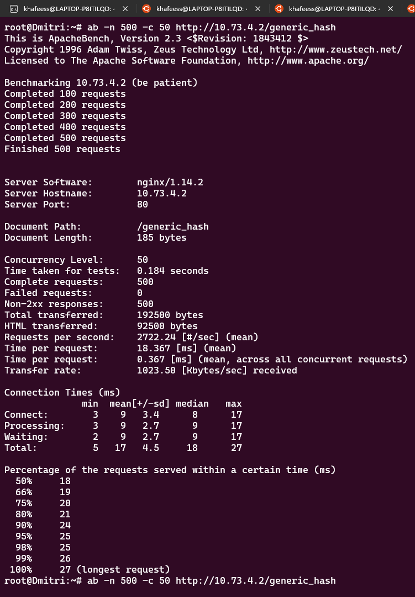
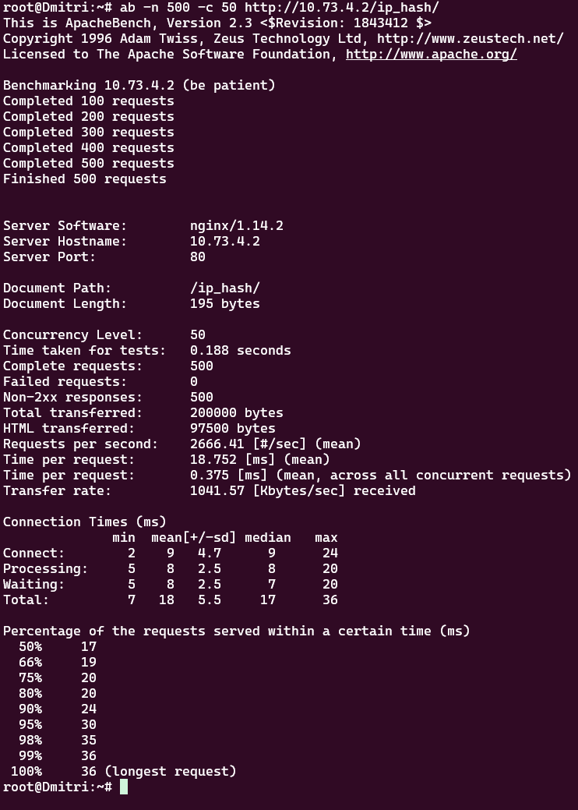
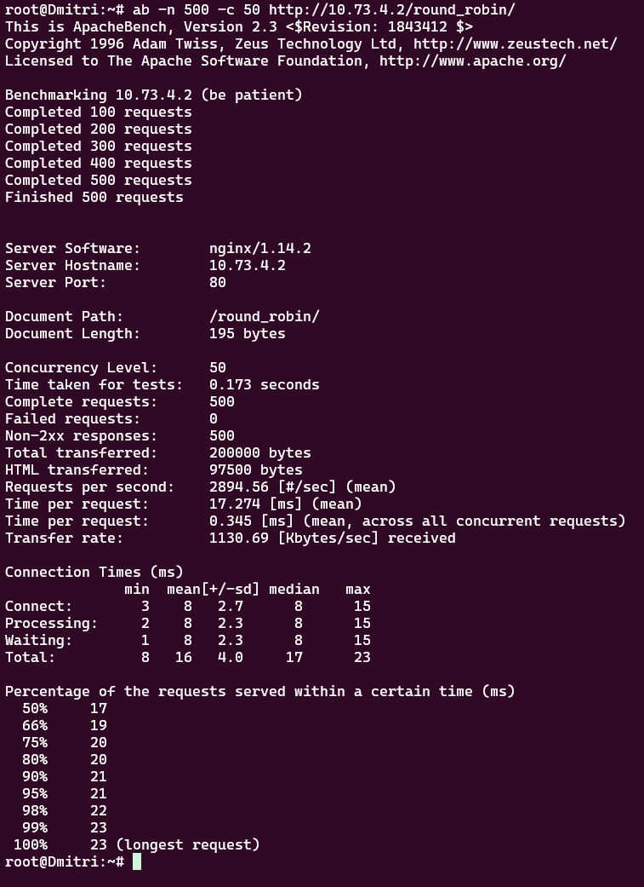
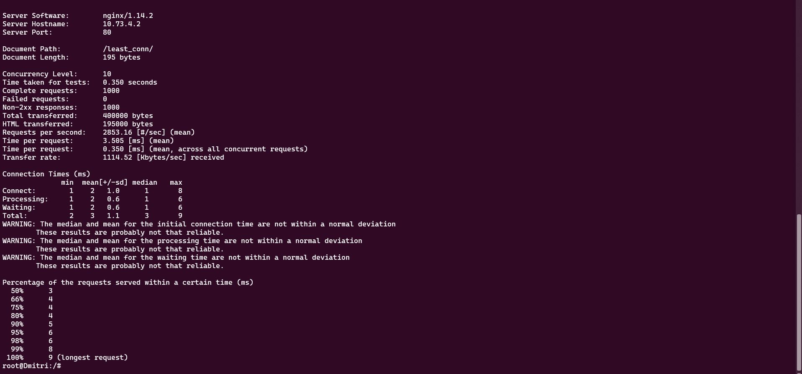
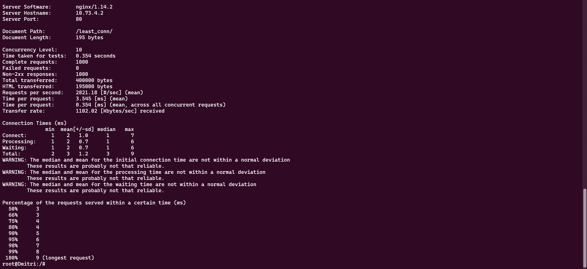
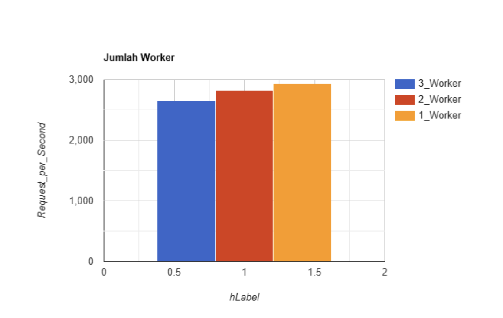
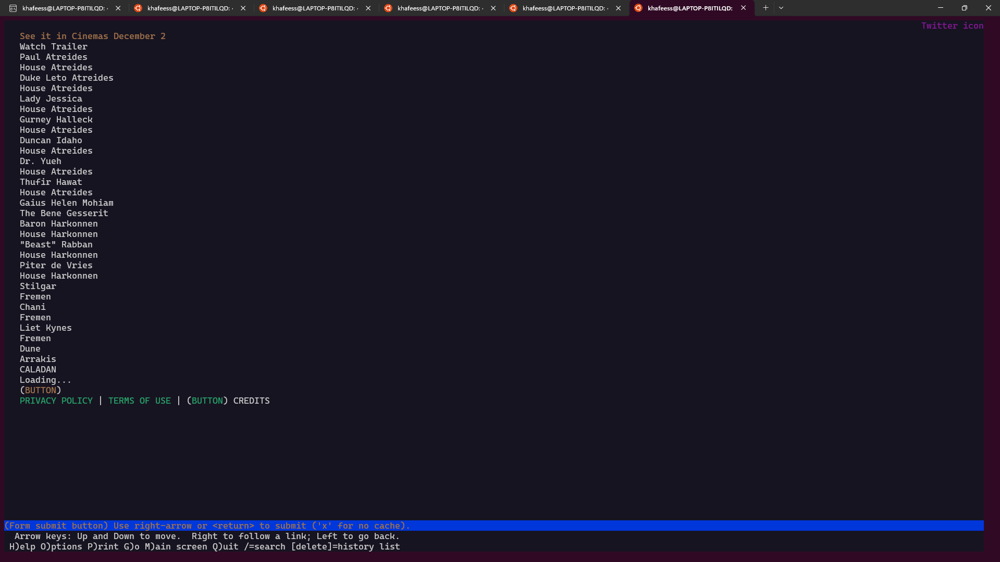
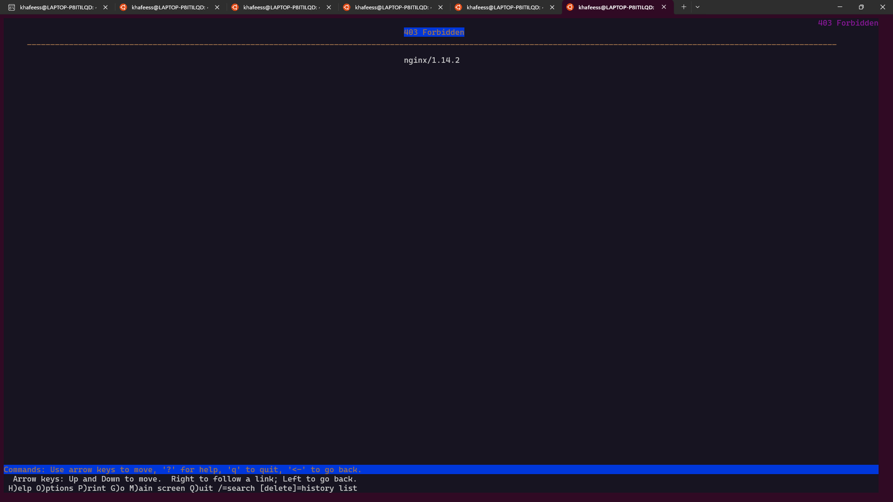

# Laporan Resmi Praktikum Jaringan Komputer Modul 3 Kelompok IT19

| NRP | Nama Anggota |
|-----|--------------|
| 5027221061 | Hafiz Akmaldi Santosa |
| 5027221049 | Arsyad Rizantha Maulana Salim |

## Topologi


## 0. Meregister domain name `atreides.yyy.com` untuk worker Laravel mengarah pada `Leto Atreides` dan mendaftarkan domain name `harkonen.yyy.com` untuk worker PHP mengarah pada `Vladimir Harkonen`.

Pertama buat bash untuk memasukkan config untuk meregister domain yang diminta:
```
apt-get update
apt-get install bind9 -y

echo 'zone "harkonen.it19.com" {
	type master;
	file "/etc/bind/jarkom/harkonen.it19.com";
	};
    
    zone "atreides.it19.com" {
	type master;
	file "/etc/bind/jarkom/atreides.it19.com";
	};' > /etc/bind/named.conf.local

mkdir /etc/bind/jarkom
cp /etc/bind/db.local /etc/bind/jarkom/harkonen.it19.com
cp /etc/bind/db.local /etc/bind/jarkom/atreides.it19.com

echo '
;
; BIND data file for local loopback interface
;
$TTL    604800
@       IN      SOA     harkonen.it19.com. root.harkonen.it19.com. (
                              2         ; Serial
                         604800         ; Refresh
                          86400         ; Retry
                        2419200         ; Expire
                         604800 )       ; Negative Cache TTL
;
@       IN      NS      harkonen.it19.com.
@       IN      A       10.73.1.3
@       IN      AAAA    ::1
' > /etc/bind/jarkom/harkonen.it19.com

echo '
;
; BIND data file for local loopback interface
;
$TTL    604800
@       IN      SOA     atreides.it19.com. root.atreides.it19.com. (
                              2         ; Serial
                         604800         ; Refresh
                          86400         ; Retry
                        2419200         ; Expire
                         604800 )       ; Negative Cache TTL
;
@       IN      NS      atreides.it19.com.
@       IN      A       10.73.2.3
@       IN      AAAA    ::1
' > /etc/bind/jarkom/atreides.it19.com
```
Kemudian restart service bind9 dengan command:
```
service bind9 restart
```

## 1. Melakukan konfigurasi sesuai dengan peta yang sudah diberikan.

<b>Arakis<b>
```
auto eth0
iface eth0 inet dhcp

auto eth1
iface eth1 inet static
	address 10.73.1.1
	netmask 255.255.255.0

auto eth2
iface eth2 inet static
	address 10.73.2.1
	netmask 255.255.255.0

auto eth3
iface eth3 inet static
	address 10.73.3.1
	netmask 255.255.255.0

auto eth4
iface eth4 inet static
	address 10.73.4.1
	netmask 255.255.255.0
```

<b>Dmitri dan Paul (Client)<b>
```
auto eth0
iface eth0 inet dhcp
```

<b>Vladimir (PHP Worker)<b>
```
auto eth0
iface eth0 inet static
	address 10.73.1.3
	netmask 255.255.255.0
	gateway 10.73.1.1
```

<b>Rabban (PHP Worker)<b>
```
auto eth0
iface eth0 inet static
	address 10.73.1.4
	netmask 255.255.255.0
	gateway 10.73.1.1
```

<b>Feyd (PHP Worker)<b>
```
auto eth0
iface eth0 inet static
	address 10.73.1.5
	netmask 255.255.255.0
	gateway 10.73.1.1
```

<b>Leto (Laravel Worker)<b>
```
auto eth0
iface eth0 inet static
	address 10.73.2.3
	netmask 255.255.255.0
	gateway 10.73.2.1
```

<b>Duncan (Laravel Worker)<b>
```
auto eth0
iface eth0 inet static
	address 10.73.2.4
	netmask 255.255.255.0
	gateway 10.73.2.1
```

<b>Jessica (Laravel Worker)<b>
```
auto eth0
iface eth0 inet static
	address 10.73.2.5
	netmask 255.255.255.0
	gateway 10.73.2.1
```

<b>Irulan (DNS Server)<b>
```
auto eth0
iface eth0 inet static
	address 10.73.3.2
	netmask 255.255.255.0
	gateway 10.73.3.1
```

<b>Mohiam (DHCP Server)<b>
```
auto eth0
iface eth0 inet static
	address 10.73.3.3
	netmask 255.255.255.0
	gateway 10.73.3.1
```

<b>Stilgar (Load Balancer)<b>
```
auto eth0
iface eth0 inet static
	address 10.73.4.2
	netmask 255.255.255.0
	gateway 10.73.4.1
```

<b>Chani (Database Server)<b>
```
auto eth0
iface eth0 inet static
	address 10.73.4.3
	netmask 255.255.255.0
	gateway 10.73.4.1
```

## 2. Client yang melalui House Harkonen mendapatkan range IP dari [prefix IP].1.14 - [prefix IP].1.28 dan [prefix IP].1.49 - [prefix IP].1.70

prefix IP IT19 = 10.73

Untuk memberikan akses internet kepada Harkonen(switch 1), lakukan configurasi berikut pada mohiam(DHCP Server).

```
apt-get update
apt-get install isc-dhcp-server -y
service isc-dhcp-server start

echo '
INTERFACESv4="eth0"
' > /etc/default/isc-dhcp-server

echo '
# Switch 1 - Harkonen
subnet 10.73.1.0 netmask 255.255.255.0 {
	range 10.73.1.14 10.73.1.28;
	range 10.73.1.49 10.73.1.70;
	option routers 10.73.1.0;
	option broadcast-address 10.73.1.255;
	option domain-name-servers 10.73.3.2; # IP Irulan
}' > /etc/dhcp/dhcpd.conf

service isc-dhcp-server restart
```
Kemudian periksa apakah client di Harkonen sudah dapat akses internet dengan `ping`.

## 3. Client yang melalui House Atreides mendapatkan range IP dari [prefix IP].2.15 - [prefix IP].2.25 dan [prefix IP].2 .200 - [prefix IP].2.210

prefix IP IT19 = 10.73

Pada configurasi sebelumnya, tambahkan config yang sama pada bash untuk memberikan akses internet ke Atreides(Switch 2).

```
apt-get update
apt-get install isc-dhcp-server -y
service isc-dhcp-server start

echo '
INTERFACESv4="eth0"
' > /etc/default/isc-dhcp-server

echo '
# Switch 1 - Harkonen
subnet 10.73.1.0 netmask 255.255.255.0 {
	range 10.73.1.14 10.73.1.28;
	range 10.73.1.49 10.73.1.70;
	option routers 10.73.1.0;
	option broadcast-address 10.73.1.255;
	option domain-name-servers 10.73.3.2; # IP Irulan

# Switch 2 - Atreides
subnet 10.73.2.0 netmask 255.255.255.0 {
	range 10.73.2.15 10.73.2.25;
	range 10.73.2.200 10.73.2.210;
	option routers 10.73.2.0;
	option broadcast-address 10.73.2.255;
	option domain-name-servers 10.73.3.2; # IP Irulan
}

# Switch 3
subnet 10.73.3.0 netmask 255.255.255.0 {}

# Switch 4
subnet 10.73.4.0 netmask 255.255.255.0 {}
}' > /etc/dhcp/dhcpd.conf


service isc-dhcp-server restart
```
Kemudian periksa apakah client di Atreides sudah dapat akses internet dengan `ping`.

## 4. Client mendapatkan DNS dari Princess Irulan dan dapat terhubung dengan internet melalui DNS tersebut.

Setelah kita menjalankan bash pada soal sebelumnya, nodes yang ada pada switch 1 dan 2 seharusnya sudah mendapat akses internet melalui DHCP Server. Untuk melakukan cek kita akan ping salah satu domain di Irulan yaitu `atreides.it19.com`.


Client Dmitri sudah dapat mengakses DNS Irulan.

## 5. Durasi DHCP server meminjamkan alamat IP kepada Client yang melalui `House Harkonen` selama 5 menit sedangkan pada client yang melalui `House Atreides` selama 20 menit. Dengan waktu maksimal dialokasikan untuk peminjaman alamat IP selama 87 menit.

Untuk itu kita akan menambahkan line pada bash config soal sebelumnya:

```
apt-get update
apt-get install isc-dhcp-server -y
service isc-dhcp-server start

echo '
INTERFACESv4="eth0"
' > /etc/default/isc-dhcp-server

echo '
# Switch 1 - Harkonen
subnet 10.73.1.0 netmask 255.255.255.0 {
	range 10.73.1.14 10.73.1.28;
	range 10.73.1.49 10.73.1.70;
	option routers 10.73.1.0;
	option broadcast-address 10.73.1.255;
	option domain-name-servers 10.73.3.2; # IP Irulan
	default-lease-time 300; # 5 menit
	max-lease-time 5220; # 87 menit
}

# Switch 2 - Atreides
subnet 10.73.2.0 netmask 255.255.255.0 {
	range 10.73.2.15 10.73.2.25;
	range 10.73.2.200 10.73.2.210;
	option routers 10.73.2.0;
	option broadcast-address 10.73.2.255;
	option domain-name-servers 10.73.3.2; # IP Irulan
	default-lease-time 1200; # 30 menit
	max-lease-time 5220; # 87 menit
}

# Switch 3
subnet 10.73.3.0 netmask 255.255.255.0 {}

# Switch 4
subnet 10.73.4.0 netmask 255.255.255.0 {}
' >  /etc/dhcp/dhcpd.conf

service isc-dhcp-server restart
```

Sehingga akan muncul lease time setiap kita mengakses client:


## 6. setiap worker(harkonen) PHP, untuk melakukan konfigurasi virtual host untuk website yang telah disediakan dengan menggunakan `php 7.3`.

Untuk itu kita akan membuat bash untuk melakukan instalasi segala kebutuhan untuk setup setiap PHP Worker:

```
apt update
apt install nginx php-fpm php7.3 apache2 unzip lynx -y

mkdir /var/www/jarkom

curl -L --insecure "https://drive.google.com/uc?export=download&id=1ViSkRq7SmwZgdK64eRbr5Fm1EGCTPrU1" -o harkonen.zip

unzip harkonen.zip -d /var/www
rm harkonen.zip

mv /var/www/modul-3/* /var/www/jarkom/
rm -rf /var/www/modul-3

echo 'server {
    listen 80;
    root /var/www/jarkom;
    index index.php index.html index.htm;
    server_name _;
    location / {
        try_files $uri $uri/ /index.php?$query_string;
    }
    location ~ \.php$ {
        include snippets/fastcgi-php.conf;
        fastcgi_pass unix:/var/run/php/php7.3-fpm.sock;
    }
    error_log /var/log/nginx/jarkom_error.log;
    access_log /var/log/nginx/jarkom_access.log;
}' >/etc/nginx/sites-available/jarkom.conf

ln -s /etc/nginx/sites-available/jarkom.conf /etc/nginx/sites-enabled/

rm /etc/nginx/sites-enabled/default

service nginx restart
service nginx status

service php7.3-fpm start
service php7.3-fpm status
```

Lalu cek salah satu web apakah sudah berhasil dijalankan dengan melakukan:
```
lynx http://10.73.1.3/
```

diatas adalah tampilan jika berhasil.

## 7. Aturlah agar `Stilgar` dari `Fremen` dapat dapat bekerja sama dengan maksimal, lalu lakukan testing dengan 5000 request dan 150 request/second.

Untuk membuat Stilgar menjadi Load Balancer, buat bash untuk melakukan instalasi keperluan Load Balancer:

```
apt-get update
apt-get install nginx php php-fpm lynx apache2-utils -y

echo 'upstream weight_round_robin  {
    server 10.73.1.3;
    server 10.73.1.4;
    server 10.73.1.5;
}

server {
    listen 80;
        server_name harkonen.it19.com;

        root /var/www/harkonen.it19.com;
        index index.html index.htm index.nginx-debian.html;\

        location / {
            proxy_pass http://weight_round_robin;
            proxy_set_header    X-Real-IP $remote_addr;
            proxy_set_header    X-Forwarded-For $proxy_add_x_forwarded_for;
            proxy_set_header    Host $http_host;
        }

    error_log /var/log/nginx/lb_error.log;
    access_log /var/log/nginx/lb_access.log;
}' > /etc/nginx/sites-available/balance_load

unlink /etc/nginx/sites-enabled/default

ln -s /etc/nginx/sites-available/balance_load /etc/nginx/sites-enabled/balance_load

service nginx restart
```

selanjutnya dengan menggunakan package `apache2-utils` kita akan mengirim 5000 request dan 150 request/second melalui client:

```
ab -n 5000 -c 150 http://10.73.4.2/
```

Hasilnya sebagai berikut:



Didapatkan hasil dengan 2635.82 request per second, selama 1.897 detik, dan terdapat 0 failed request

## 8. Menuliskan peta tercepat menuju spice, lalu buatlah analisis hasil testing dengan 500 request dan 50 request/second masing-masing algoritma Load Balancer.

Ada empat jenis algortima load balancer yang digunakan pada pengerjaan nomor ini, yaitu:
1. Generic Hash
2. IP Hash
3. Least Connection
4. Round Robin

Sebelum itu kita tambahkan algortima yang akan digunakan dalam config Load Balancer:
```
apt-get update
apt-get install nginx php php-fpm lynx apache2-utils -y

echo 'upstream round_robin_workers {
    server 10.73.1.3;
    server 10.73.1.4;
    server 10.73.1.5;
}

upstream least_conn_workers {
    least_conn;
    server 10.73.1.3;
    server 10.73.1.4;
    server 10.73.1.5;
}

upstream ip_hash_workers {
    ip_hash;
    server 10.73.1.3;
    server 10.73.1.4;
    server 10.73.1.5;
}

upstream generic_hash_workers {
    hash $request_uri;
    server 10.73.1.3;
    server 10.73.1.4;
    server 10.73.1.5;
}

server {
    listen 80;
    server_name harkonen.it19.com;

    root /var/www/harkonen.it19.com;
    index index.html index.htm index.nginx-debian.html;\

    location /round_robin/ {
        proxy_pass http://round_robin_workers;
        proxy_set_header Host $host;
        proxy_set_header X-Real-IP $remote_addr;
        proxy_set_header X-Forwarded-For $proxy_add_x_forwarded_for;
        proxy_set_header X-Forwarded-Proto $scheme;
    }

    location /least_conn/ {
        proxy_pass http://least_conn_workers;
        proxy_set_header Host $host;
        proxy_set_header X-Real-IP $remote_addr;
        proxy_set_header X-Forwarded-For $proxy_add_x_forwarded_for;
        proxy_set_header X-Forwarded-Proto $scheme;
    }

    location /ip_hash/ {
        proxy_pass http://ip_hash_workers;
        proxy_set_header Host $host;
        proxy_set_header X-Real-IP $remote_addr;
        proxy_set_header X-Forwarded-For $proxy_add_x_forwarded_for;
        proxy_set_header X-Forwarded-Proto $scheme;
    }

    location /generic_hash/ {
        proxy_pass http://generic_hash_workers;
        proxy_set_header Host $host;
        proxy_set_header X-Real-IP $remote_addr;
        proxy_set_header X-Forwarded-For $proxy_add_x_forwarded_for;
        proxy_set_header X-Forwarded-Proto $scheme;
    }
    
}' > /etc/nginx/sites-available/balance_load

unlink /etc/nginx/sites-enabled/default

ln -s /etc/nginx/sites-available/balance_load /etc/nginx/sites-enabled/balance_load

service nginx restart
```

Kemudian lakukan benchmark menggunakan `apache2-utils`:

1. Generic Hash
```
ab -n 500 -c 50 http://10.73.4.2/generic_hash
```


2. IP Hash
```
ab -n 500 -c 50 http://10.73.4.2/ip_hash/
```


3. Least Connection
```
ab -n 500 -c 50 http://10.73.4.2/least_conn/
```


4. Round Robin
```
ab -n 500 -c 50 http://10.73.4.2/round_robin/
```


Berikut adalah perbandingan Request per Second antar algoritma Load Balancer:


## 9. Dengan menggunakan algoritma Least-Connection, lakukan testing dengan menggunakan 3 worker, 2 worker, dan 1 worker sebanyak 1000 request dengan 10 request/second, kemudian tambahkan grafiknya pada peta.

1. Dengan 3 Worker
```
ab -n 1000 -c 10 http://10.73.4.2/least_conn/
```


2. Dengan 2 Worker
```
ab -n 1000 -c 10 http://10.73.4.2/least_conn/
```


3. Dengan 1 Worker
```
ab -n 1000 -c 10 http://10.73.4.2/least_conn/
```


Setelah dilakukan benchmark terhadap jumlah worker, didapatkan perbandingan sebagai berikut:



## 10. Selanjutnya coba tambahkan keamanan dengan konfigurasi autentikasi di Load Balancer dengan dengan kombinasi username: `“secmart”` dan password: `“kcksit19”`. Terakhir simpan file `“htpasswd”` nya di `/etc/nginx/supersecret/`.

Untuk memberikan auth kita akan menambahkan config pada load balancer sebagai berikut:
```
mkdir -p /etc/nginx/supersecret
htpasswd -bc /etc/nginx/supersecret/htpasswd secmart kcksit19

echo 'upstream round_robin_workers {
    server 10.73.1.3;
    server 10.73.1.4;
    server 10.73.1.5;
}

upstream least_conn_workers {
    least_conn;
    server 10.73.1.3;
    server 10.73.1.4;
    server 10.73.1.5;
}

upstream ip_hash_workers {
    ip_hash;
    server 10.73.1.3;
    server 10.73.1.4;
    server 10.73.1.5;
}

upstream generic_hash_workers {
    hash $request_uri;
    server 10.73.1.3;
    server 10.73.1.4;
    server 10.73.1.5;
}
server {
    listen 80;
    server_name harkonen.it19.com;

    root /var/www/harkonen.it19.com;
    index index.html index.htm index.nginx-debian.html;

    location /round_robin/ {
        auth_basic "Restricted Content";
        auth_basic_user_file /etc/nginx/supersecret/htpasswd;
        proxy_pass http://round_robin_workers;
        proxy_set_header Host $host;
        proxy_set_header X-Real-IP $remote_addr;
        proxy_set_header X-Forwarded-For $proxy_add_x_forwarded_for;
        proxy_set_header X-Forwarded-Proto $scheme;
    }

    location /least_conn/ {
        auth_basic "Restricted Content";
        auth_basic_user_file /etc/nginx/supersecret/htpasswd;
        proxy_pass http://least_conn_workers;
        proxy_set_header Host $host;
        proxy_set_header X-Real-IP $remote_addr;
        proxy_set_header X-Forwarded-For $proxy_add_x_forwarded_for;
        proxy_set_header X-Forwarded-Proto $scheme;
    }

    location /ip_hash/ {
        auth_basic "Restricted Content";
        auth_basic_user_file /etc/nginx/supersecret/htpasswd;
        proxy_pass http://ip_hash_workers;
        proxy_set_header Host $host;
        proxy_set_header X-Real-IP $remote_addr;
        proxy_set_header X-Forwarded-For $proxy_add_x_forwarded_for;
        proxy_set_header X-Forwarded-Proto $scheme;
    }

    location /generic_hash/ {
        auth_basic "Restricted Content";
        auth_basic_user_file /etc/nginx/supersecret/htpasswd;
        proxy_pass http://generic_hash_workers;
        proxy_set_header Host $host;
        proxy_set_header X-Real-IP $remote_addr;
        proxy_set_header X-Forwarded-For $proxy_add_x_forwarded_for;
        proxy_set_header X-Forwarded-Proto $scheme;
    }
}' > /etc/nginx/sites-available/balance_load

unlink /etc/nginx/sites-enabled/default

ln -s /etc/nginx/sites-available/balance_load /etc/nginx/sites-enabled/balance_load

service nginx restart
```

Setelah itu, coba masuk ke salah satu worker melalui client dan cek apakah terdapat auth:
```
lynx http://10.42.4.2/least_conn/
```


Setelah memasukkan Username dan Password yang telah di set pada bash, kita berhasil melakuakan login.

## 11. Buat untuk setiap request yang mengandung `/dune` akan di proxy passing menuju halaman `https://www.dunemovie.com.au/`.

Kita akan menambahkan proxy passing pada config Load Balancer tadi:
```
    location /dune {
        rewrite ^/dune(.*)$ https://www.dunemovie.com.au$1 break;
        proxy_pass https://www.dunemovie.com.au;
        proxy_set_header Host www.dunemovie.com.au;
        proxy_set_header X-Real-IP $remote_addr;
        proxy_set_header X-Forwarded-For $proxy_add_x_forwarded_for;
        proxy_set_header X-Forwarded-Proto $scheme;
    }
```
Restart service nginx pada Load Balancer lalu cek melalui client:
```
lynx http://10.73.4.2/dune
```


## 12. Load Balancer ini hanya boleh diakses oleh client dengan IP `[Prefix IP].1.37`, `[Prefix IP].1.67`, `[Prefix IP].2.203`, dan `[Prefix IP].2.207`.

Prefix IP IT19 = 10.73

Kita akan menambahkan `allow` dan `deny` pada config Load Balancer:
```
location / {
    allow 10.73.1.37;
    allow 10.73.1.67;
    allow 10.73.2.203;
    allow 10.73.2.207;
    allow 10.73.4.2;
    deny all;
}
```

Config ini akan menerima IP yang ada dalam daftar `allow` dan menolak semua yang tidak. Restart `nginx service` pada Load Balancer kemudian cek pada client menggunakan `lynx` dengan IP yang tidak ada dalam daftar `allow`. Berikut adalah contoh apabila IP tidak terdaftar:



## 13. Semua data yang diperlukan, diatur pada Chani dan harus dapat diakses oleh Leto, Duncan, dan Jessica.

Tambahkan script berikut pada Chani sebagai Database Server.
```
#!/bin/bash

apt update
apt install mariadb-server -y

service mysql start

mysql <<EOF
CREATE USER 'kelompokit19'@'%' IDENTIFIED BY 'passwordit19';
CREATE USER 'kelompokit19'@'localhost' IDENTIFIED BY 'passwordit19';
CREATE DATABASE dbkelompokit19;
GRANT ALL PRIVILEGES ON *.* TO 'kelompokit19'@'%';
GRANT ALL PRIVILEGES ON *.* TO 'kelompokit19'@'localhost';
FLUSH PRIVILEGES;
quit
EOF

mysql -u kelompokit19 -p'passwordit19' <<EOF
SHOW DATABASES;
quit
EOF

echo '[client-server]

# Import all .cnf files from configuration directory
!includedir /etc/mysql/conf.d/
!includedir /etc/mysql/mariadb.conf.d/

[mysqld]
skip-networking=0
skip-bind-address' >/etc/mysql/my.cnf

service mysql restart
```
Lalu melakukan testing dengan connect dari salah satu laravel worker ke database, dengan password `passwordit19`.
```
mariadb --host=10.73.2.2 --port=3306 --user=kelompokit19 --password
```

## 14. Leto, Duncan, dan Jessica memiliki atreides Channel sesuai dengan [quest guide](https://github.com/martuafernando/laravel-praktikum-jarkom) berikut. Jangan lupa melakukan instalasi PHP8.0 dan Composer.

Meakukan install depedency dasar yang digunakan.
```
apt-get update
apt-get install lynx -y
apt-get install mariadb-client -y
apt-get install -y lsb-release ca-certificates apt-transport-https software-properties-common gnupg2
curl -sSLo /usr/share/keyrings/deb.sury.org-php.gpg https://packages.sury.org/php/apt.gpg
sh -c 'echo "deb [signed-by=/usr/share/keyrings/deb.sury.org-php.gpg] https://packages.sury.org/php/ $(lsb_release -sc) main" > /etc/apt/sources.list.d/php.list'
apt-get update
```
Kemudian melakukan instalasi kebutuhan `PHP 8.0`
```
apt-get install php8.0-mbstring php8.0-xml php8.0-cli php8.0-common php8.0-intl php8.0-opcache php8.0-readline php8.0-mysql php8.0-fpm php8.0-curl unzip wget -y
apt-get install nginx -y
service nginx start
service php8.0-fpm start
```
Lalu install `composer`
```
wget https://getcomposer.org/download/2.0.13/composer.phar
chmod +x composer.phar
mv composer.phar /usr/local/bin/composer
```
Melakukan git clone pada repository [quest guide](https://github.com/martuafernando/laravel-praktikum-jarkom) serta jalankan:
```
apt-get install git -y
cd /var/www 
git clone https://github.com/martuafernando/laravel-praktikum-jarkom
cd /var/www/laravel-praktikum-jarkom 
composer update
```
Jalankan kode berikut untuk melakukan konfigurasi pada `worker`.
```
cd /var/www/laravel-praktikum-jarkom 
cp .env.example .env
echo '
APP_NAME=Laravel
APP_ENV=local
APP_KEY=
APP_DEBUG=true
APP_URL=http://localhost

LOG_CHANNEL=stack
LOG_DEPRECATIONS_CHANNEL=null
LOG_LEVEL=debug

DB_CONNECTION=mysql
DB_HOST=10.73.2.2
DB_PORT=3306
DB_DATABASE=dbkelompokit19
DB_USERNAME=kelompokit19
DB_PASSWORD=passwordit19

BROADCAST_DRIVER=log
CACHE_DRIVER=file
FILESYSTEM_DISK=local
QUEUE_CONNECTION=sync
SESSION_DRIVER=file
SESSION_LIFETIME=120

MEMCACHED_HOST=127.0.0.1

REDIS_HOST=127.0.0.1
REDIS_PASSWORD=null
REDIS_PORT=6379

MAIL_MAILER=smtp
MAIL_HOST=mailpit
MAIL_PORT=1025
MAIL_USERNAME=null
MAIL_PASSWORD=null
MAIL_ENCRYPTION=null
MAIL_FROM_ADDRESS="hello@example.com"
MAIL_FROM_NAME="${APP_NAME}"

AWS_ACCESS_KEY_ID=
AWS_SECRET_ACCESS_KEY=
AWS_DEFAULT_REGION=us-east-1
AWS_BUCKET=
AWS_USE_PATH_STYLE_ENDPOINT=false

PUSHER_APP_ID=
PUSHER_APP_KEY=
PUSHER_APP_SECRET=
PUSHER_HOST=
PUSHER_PORT=443
PUSHER_SCHEME=https
PUSHER_APP_CLUSTER=mt1

VITE_PUSHER_APP_KEY="${PUSHER_APP_KEY}"
VITE_PUSHER_HOST="${PUSHER_HOST}"
VITE_PUSHER_PORT="${PUSHER_PORT}"
VITE_PUSHER_SCHEME="${PUSHER_SCHEME}"
VITE_PUSHER_APP_CLUSTER="${PUSHER_APP_CLUSTER}"
' > /var/www/laravel-praktikum-jarkom/.env
cd /var/www/laravel-praktikum-jarkom
php artisan key:generate
php artisan config:cache
php artisan migrate
php artisan db:seed
php artisan storage:link
php artisan jwt:secret
php artisan config:clear
chown -R www-data.www-data /var/www/laravel-praktikum-jarkom/storage


echo '
 server {
 	listen 8001;

 	root /var/www/laravel-praktikum-jarkom/public;

 	index index.php index.html index.htm;
 	server_name _;

 	location / {
 			try_files $uri $uri/ /index.php?$query_string;
 	}

 	# pass PHP scripts to FastCGI server
 	location ~ \.php$ {
 	include snippets/fastcgi-php.conf;
 	fastcgi_pass unix:/var/run/php/php8.0-fpm.sock;
 	}

    location ~ /\.ht {
 			deny all;
 	}

    error_log /var/log/nginx/implementasi_error.log;
    access_log /var/log/nginx/implementasi_access.log;
 }
' > /etc/nginx/sites-available/implementasi
ln -s /etc/nginx/sites-available/implementasi /etc/nginx/sites-enabled/
unlink /etc/nginx/sites-enabled/default

chown -R www-data.www-data /var/www/laravel-praktikum-jarkom-main/storage

service php8.0-fpm start
service nginx restart
```
Untuk mengecek apakah kode sudah benar bisa menggunakan `nginx -t`. Pada bagian:
```
server {
 	listen 8001; ...... }
```
Portnya diganti sesuai dengan port masing masing worker. Kami membagi port sebagai berikut:
- 8001: Leto
- 8002: Duncan
- 8003: Jessia

Kemudian setelah melakukan konfigurasi, cek dengan menjalankan `lynx localhost:<port worker>`. (Contoh lynx localhost:8001).


## 15. Atreides Channel memiliki beberapa endpoint yang harus ditesting sebanyak 100 request dengan 10 request/second. Tambahkan response dan hasil testing pada peta.
POST /auth/register

Buat file `login.json` yang nantinya akan dikirimkan dalam perintah `/POST` pada client
```
echo '
{
    "username": "kelompokit11",
    "password": "passwordit11"
}
' > /var/www/laravel-praktikum-jarkom/login.json
```
jalankan perintah berikut pada client `ab  -n 100 -c 10 -p login.json -T application/json http://10.73.4.2:8001/api/auth/register` Untuk bagian `http://10.73.4.2:8001` disesuaikan dengan ip worker:portnya yang ingin diuji. Disini sebagai contoh digunakan ip:port dari worker Leto.


## 16. Atreides Channel memiliki beberapa endpoint yang harus ditesting sebanyak 100 request dengan 10 request/second. Tambahkan response dan hasil testing pada peta.
POST /auth/login

Jalankan perintah berikut pada client.

`ab  -n 100 -c 10 -p login.json -T application/json http://10.73.4.2:8001/api/auth/login`

File `.JSON` yang digunakan sama seperti no 15.


## 17. Atreides Channel memiliki beberapa endpoint yang harus ditesting sebanyak 100 request dengan 10 request/second. Tambahkan response dan hasil testing pada peta.
GET /me

```
curl -X POST -H "Content-Type: application/json" -d @regis.json http://10.73.4.2:8001/api/auth/login > login_token.txt
```
Kode tersebut akan menyimpan respon `JSON` kedalam `login_token.txt`.

## 18. Untuk memastikan ketiganya bekerja sama secara adil untuk mengatur `atreides` Channel maka implementasikan `Proxy Bind` pada `Stilgar` untuk mengaitkan IP dari Leto, Duncan, dan Jessica.
```
echo 'upstream laravel_least_conn  {
    server 10.73.2.3:8001; #IP Leto
    server 10.73.2.4:8002; #IP Duncan
    server 10.73.2.5:8003; #IP Jessica
}

server {
    listen 87;

    location /app1 {
        proxy_pass http://10.73.2.3/;
        proxy_bind 10.73.2.3; #IP Leto
        rewrite ^/app1(.*)$ http://10.73.2.3/$1 permanent;
    }

    location /app2 {
        proxy_pass http://10.73.2.4/;
        proxy_bind 10.73.4.4; #IP Duncan
        rewrite ^/app2(.*)$ http://10.73.2.4/$1 permanent;
    }

    location /app3 {
        proxy_pass http://10.73.2.5/;
        proxy_bind 10.73.2.5; #IP Jessica
        rewrite ^/app3(.*)$ http://10.73.2.5/$1 permanent;
    }

    location / {
        proxy_pass http://laravel_least_conn;
        proxy_set_header    X-Real-IP $remote_addr;
        proxy_set_header    X-Forwarded-For $proxy_add_x_forwarded_for;
        proxy_set_header    Host $http_host;
    }

    error_log /var/log/nginx/lb_error.log;
    access_log /var/log/nginx/lb_access.log;
}' >/etc/nginx/sites-available/proxy-bind

unlink /etc/nginx/sites-enabled/default

ln -s /etc/nginx/sites-available/proxy-bind /etc/nginx/sites-enabled/proxy-bind

service nginx restart
```
Untuk mengetestnya, jalankan kode berikut pada client:
```
ab  -n 100 -c 10 -p login.json -T application/json http://10.73.4.2:87/api/auth/register
```
`10.73.4.2` merupakan IP dari `Stilgar`. Setelah dijalankan, pergi ke worker laravel untuk menentukan apakah berhasil melakukan proxy bind dengan mengecek lognya.

Perintah yang digunakan untuk mengecek log adalah dengan
```
cat /var/log/nginx/implementasi_access.log
```

## 19
Untuk meningkatkan performa dari Worker, coba implementasikan PHP-FPM pada Leto, Duncan, dan Jessica. Untuk testing kinerja naikkan 
- pm.max_children
- pm.start_servers
- pm.min_spare_servers
- pm.max_spare_servers
sebanyak tiga percobaan dan lakukan testing sebanyak 100 request dengan 10 request/second kemudian berikan hasil analisisnya pada PDF.

Edit file konfigurasi berikut pada `Stilgar`.
```
#!/bin/bash
echo '[lb_site]
user = lb_user
group = lb_user
listen = /var/run/php8.0-fpm-lb-site.sock
listen.owner = www-data
listen.group = www-data
php_admin_value[disable_functions] = exec,passthru,shell_exec,system
php_admin_flag[allow_url_fopen] = off

; Choose how the process manager will control the number of child processes.

pm = dynamic
pm.max_children = <edit here>
pm.start_servers = <edit here>
pm.min_spare_servers = <edit here>
pm.max_spare_servers = <edit here>
pm.process_idle_timeout = 10s

;' >/etc/php/8.0/fpm/pool.d/lb.conf

groupadd lb_user
useradd -g lb_user lb_user

/etc/init.d/php8.0-fpm restart
/etc/init.d/php8.0-fpm status
```
Kemudian jalankan testing pada tiap perubahan script. Disini sebagai contoh dilakukan percobaan pada worker Frieren dengan menjalankan kode
```
ab  -n 100 -c 10 -p login.json -T application/json http://10.73.4.2:8003/api/auth/register
```
script 1:
```
pm = dynamic
pm.max_children = 25
pm.start_servers = 5
pm.min_spare_servers = 3
pm.max_spare_servers = 10
pm.process_idle_timeout = 10s
```

script 2:
```
pm = dynamic
pm.max_children = 50
pm.start_servers = 8
pm.min_spare_servers = 5
pm.max_spare_servers = 15
pm.process_idle_timeout = 10s
```

Script 3:
```
pm = dynamic
pm.max_children = 75
pm.start_servers = 10
pm.min_spare_servers = 5
pm.max_spare_servers = 20
pm.process_idle_timeout = 10s
```
Penjelasan:
- `pm.max_children`: Menentukan jumlah maksimum proses anak (child processes) yang PHP-FPM dapat buat untuk melayani permintaan.
- `pm.start_servers`: Menentukan jumlah proses anak yang akan dibuat saat PHP-FPM pertama kali dijalankan.
- `pm.min_spare_servers`: Menentukan jumlah minimum proses anak yang akan dijaga hidup oleh PHP-FPM saat tidak ada permintaan yang diterima.
- `pm.max_spare_servers`: Menentukan jumlah maksimum proses anak yang diizinkan tetap hidup oleh PHP-FPM saat tidak ada permintaan yang diterima.

## 20. Nampaknya hanya menggunakan PHP-FPM tidak cukup untuk meningkatkan performa dari worker maka implementasikan Least-Conn pada Stilgar. Untuk testing kinerja dari worker tersebut dilakukan sebanyak 100 request dengan 10 request/second.

Lakukan modifikasi pada kode berikut:
```
echo 'upstream weight_round_robin  {
    server 10.73.1.3;
    server 10.73.1.4;
    server 10.73.1.5;
}

server {
    listen 80;
        server_name harkonen.it19.com;

        root /var/www/harkonen.it19.com;
        index index.html index.htm index.nginx-debian.html;\

        location / {
            proxy_pass http://weight_round_robin;
            proxy_set_header    X-Real-IP $remote_addr;
            proxy_set_header    X-Forwarded-For $proxy_add_x_forwarded_for;
            proxy_set_header    Host $http_host;
        }

    error_log /var/log/nginx/lb_error.log;
    access_log /var/log/nginx/lb_access.log;
}' > /etc/nginx/sites-available/balance_load

unlink /etc/nginx/sites-enabled/default

ln -s /etc/nginx/sites-available/balance_load /etc/nginx/sites-enabled/balance_load

service nginx restart
```
dengan menambahkan `Least_conn;` seperti ini:
```
echo 'upstream laravel_least_conn  {
    least_conn;
    server 10.73.1.3;
    server 10.73.1.4;
    server 10.73.1.5;
}
```
